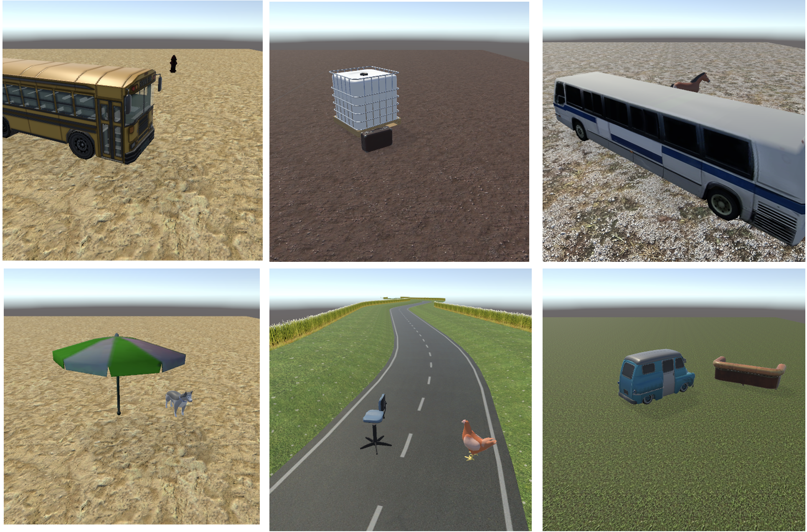

# FoREST: Frame of Reference Evaluation in Spatial Reasoning Tasks
This repository is associated with the FoREST: Frame of Reference Evaluation in Spatial Reasoning Tasks
paper. This repository provides the code for context generation and the evaluation tasks related to FoREST.

---

## Setup Environment

Please run the below command to create the environment,

```bash
# Create a conda environment
conda create -n FoREST python=3.11
conda activate FoREST

# Install requirements
pip install -r requirements.txt
```

---
## Dataset Creation
### Pipeline

Pipeline for dataset creation, starting from selecting a locatum and relatum from available objects and then applying a spatial template to generate the spatial expression (T). 
FoRs are assigned based on the relatum’s properties. Then, based on the number of FoRs, T is categorized.
For example, *A cat is to the right of a dog.* (with two possible FoRs: external intrinsic and external relative) belongs to the A-split. 
Then, its disambiguated version (*A cat is to the right of a dog from the dog's perspective*) is added to the C-split. Next, if applicable, a relatum's orientation is included for visualization and question generation. 
Finally, Unity3D generates scene configurations, creating question-answer pairs from T.

### Relatum Properties for Frame of Reference Cases

We provide the relatum properties used for creating each Frame of Reference case below (*Note that the images are only for visualization*),


### Visualization

The visualization is created separately using the Unity3D engine. **Instructions for running this are awaited for updating.**

Examples of synthetic images are provided below,



**All images will be downloadable using the hugging fact dataset (This will be updated soon).**


[//]: # (The code for generating visualization is provided [here]&#40;&#41;. )


---

## Task Evaluation

We utilize the FoREST benchmark to evaluate three tasks. 
The two main tasks focus on spatial reasoning: question-answering (QA) and text-to-image (T2I).
All evaluation tasks can be found below,

### [Question-Answering (QA).](question-answering/README.md)
### [Text-to-Image Generation (T2I).](text-to-image/README.md)
### [FoR Identification.](FoR-Identification/README.md)


---

## Citation

If you find this repository useful, please cite

```bibtex

```

